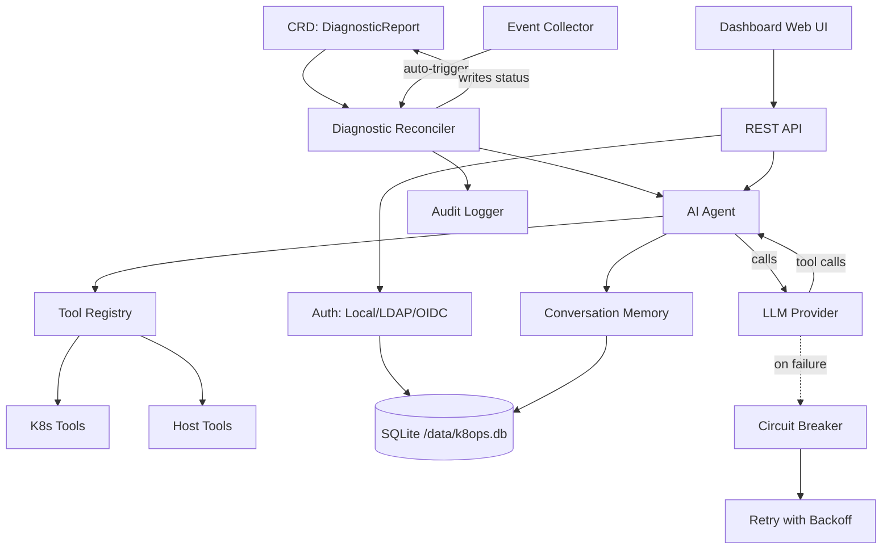

# k8ops Architecture

## Overview

k8ops is a Kubernetes AIOps operator that uses AI agents to diagnose cluster issues, suggest optimizations, and execute remediations. It runs as an in-cluster controller with an embedded web dashboard.

### AIOps 智能分析引擎

k8ops 内置多个跨维度智能分析引擎，实现从被动监控到主动预测的升级：

| 引擎 | 端点 | 维度 | 能力 |
|------|------|------|------|
| 事件关联与根因 | `/api/operations/incident-correlation` | Operations | Union-Find 多信号关联，根因猜测（置信度），爆炸半径 |
| 服务依赖拓扑 | `/api/product/service-topology` | Product | 集群级依赖图，关键枢纽识别，级联故障风险 |
| 混沌就绪评估 | `/api/deployment/chaos-readiness` | Deployment | 六标准韧性评分，安全实验推荐 |
| 碳足迹追踪 | `/api/scalability/carbon-footprint` | Scalability | 能耗估算，碳归因，减碳机会，绿色评分 |
| 准入控制审计 | `/api/security/admission-policy-audit` | Security | Webhook 健康，覆盖率分析，CEL 策略推荐 |
| Pod 异常检测 | `/api/operations/pod-anomaly` | Operations | 统计同行比较，异常值检测，嘈杂邻居识别 |
| 暴露面风险地图 | `/api/product/exposure-map` | Product | 全集群攻击面映射，TLS/auth 缺口，孤儿端点 |
| 扩缩容模拟器 | `/api/scalability/scale-simulator` | Scalability | What-If 分析，节点容量/配额/PDB/HPA 约束检查 |
| 回滚风险评估 | `/api/deployment/rollback-risk` | Deployment | 修订历史，镜像稳定性，配置依赖，成熟度 |
| Pod 生命周期追踪 | `/api/operations/pod-lifecycle` | Operations | 阶段追踪，停留时间百分位，卡住 Pod 检测 |
| RBAC 提权分析 | `/api/security/rbac-graph` | Security | 权限图构建，提权路径发现（escalate/exec/secret） |
| 网关健康审计 | `/api/product/gateway-audit` | Product | 控制器发现（10 种），孤儿路由，主机冲突，TLS 缺口 |
| 成本分摊计费 | `/api/scalability/cost-allocation` | Scalability | 按命名空间/工作负载成本分解，闲置资源，节省机会 |
| GitOps 管道审计 | `/api/deployment/gitops-audit` | Deployment | 工具发现，Helm 清单，采用率，配置漂移 |
| Metrics 管道审计 | `/api/operations/metrics-pipeline-audit` | Operations | 11 组件发现，五维评分卡，覆盖率分析 |
| 合规框架映射 | `/api/security/compliance-map` | Security | SOC2/PCI-DSS/HIPAA，18 项控制，通过/失败判定 |
| 探针有效性分析 | `/api/product/probe-effectiveness` | Product | 覆盖率%，无效配置，高风险识别（有探针仍重启） |
| 升级就绪审计 | `/api/scalability/node-upgrade-audit` | Scalability | 版本偏斜，节点压力，PDB 覆盖，弃用 API |
| 预测性健康引擎 | `/api/operations/predictive-health` | Operations | 节点/Pod 风险预测，容量趋势，证书过期时间线，30天风险预报 |
| 部署就绪门禁 | `/api/deployment/change-readiness` | Deployment | CI/CD 预检门禁，8项检查，proceed/blocked 决策 |
| 资源请求智能 | `/api/scalability/request-intelligence` | Scalability | 多信号 Right-Sizing，过度/不足供给检测，月度节省估算 |
| 可靠性评分卡 | `/api/product/reliability-scorecard` | Product | 7维 A-F 评级，集群级评分，弱点信号分析 |
| 安全态势评分卡 | `/api/security/posture-scorecard` | Security | 5维安全评估，攻击面量化，特权/hostNetwork 检测 |
| 成本智能引擎 | `/api/scalability/cost-intelligence` | Scalability | 成本趋势/异常检测，支出预测，FinOps 成熟度评分（A-F） |
| 黄金信号引擎 | `/api/product/golden-signals` | Product | SRE 四大黄金信号（延迟/流量/错误/饱和度）统一健康视图，跨信号复合故障检测 |
| 修复优先级矩阵 | `/api/security/remediation-matrix` | Security | CVSS 风险评分，快速修复 vs 战略修复分类，Top-15 修复计划 |
| MTTR 事件引擎 | `/api/operations/mttr` | Operations | MTTR/MTTD 估算，CrashLoop/OOMKill 恢复时间，事件频率与突发检测 |
| 发布取证引擎 | `/api/deployment/rollout-forensics` | Deployment | 发布故障取证，部署反模式检测，逐负载发布可靠性评分（A-F） |
| 扩缩容智能引擎 | `/api/scalability/autoscaling-intel` | Scalability | HPA 覆盖率分析，扩缩容缺口检测，HPA 调参建议，扩缩容行为画像 |

这些引擎相互协作形成完整的 AIOps 闭环：发现风险（拓扑/事件/异常） → 预测未来（预测性健康引擎） → 评分定级（可靠性评分卡） → 门禁拦截（变更就绪预检） → 评估韧性（混沌就绪/探针） → 模拟影响（扩缩容/升级） → 追踪成本与合规（碳足迹/成本分摊/SOC2/Right-Sizing） → 加固防线（准入控制/RBAC 提权）。

## Six-Layer Architecture

```
┌─────────────────────────────────────────────────────────────┐
│                    Dashboard Layer                          │
│  Embedded Web UI + REST API (port :9090)                    │
│  dashboard/server.go                                        │
├─────────────────────────────────────────────────────────────┤
│                    Service Layer                            │
│  auth · chat · provider · providermanager · metrics ·       │
│  audit · memory · collector · resilience · safety           │
├─────────────────────────────────────────────────────────────┤
│                    Agent Layer                              │
│  Observe → Think → Act loop (agent/agent.go)                │
│  Max 15 steps, 180s timeout, tool-calling LLM               │
├─────────────────────────────────────────────────────────────┤
│                    Controller Layer                         │
│  diagnostic · optimization · remediation reconcilers        │
│  Watches CRDs, triggers Agent, writes results back          │
├─────────────────────────────────────────────────────────────┤
│                    Tool Layer                               │
│  tools/k8s (get/describe/logs/exec/top)                     │
│  tools/host (process, dmesg) · tools/remediation            │
│  tools/registry.go — thread-safe tool registry              │
├─────────────────────────────────────────────────────────────┤
│                    API Layer (CRD Types)                    │
│  api/v1alpha1: DiagnosticReport, OptimizationSuggestion,   │
│  RemediationPlan, K8opsConfig                              │
└─────────────────────────────────────────────────────────────┘
```

## Component Relationships



## Data Flow

### Automated Diagnostic Flow

```
1. Kubernetes Event (e.g., Pod CrashLoopBackOff)
   ↓
2. Event Collector detects anomaly
   ↓
3. Controller creates DiagnosticReport CRD
   ↓
4. Diagnostic Reconciler picks up CRD
   ↓
5. Agent launches Observe→Think→Act loop:
   a. Observe: collects events, logs, resource state via tools
   b. Think: sends context to LLM with tool definitions
   c. Act: executes tool calls (kubectl describe, logs, etc.)
   d. Loop: feeds results back (max 15 steps, 180s timeout)
   ↓
6. Agent writes analysis + recommendations to CRD status
   ↓
7. Dashboard displays results in Web UI
```

### Interactive Chat Flow

```
1. User authenticates (Local/LDAP/OIDC) → JWT token
   ↓
2. User sends message via Dashboard /api/chat (SSE)
   ↓
3. Chat Engine creates/reuses Conversation (memory layer)
   ↓
4. Provider Manager selects active LLM provider
   ↓
5. Agent loop: LLM ↔ Tools (with retry + circuit breaker)
   ↓
6. Streaming response via SSE to browser
   ↓
7. Conversation stored with TTL cleanup (30min idle, 1000 cap)
```

### Resilience

- **Retry**: 5 attempts, exponential backoff (1s→30s, 2x multiplier)
- **Circuit Breaker**: opens after 5 consecutive failures, 60s cooldown
- **Retryable errors**: 429, 500, 502, 503, timeout, connection errors
- **Non-retryable**: 400, 401, 403, 404

## Deployment Architecture

```
┌──────────────────────────────────────────┐
│           k8ops Pod                       │
│                                           │
│  ┌─────────────┐  ┌──────────────────┐   │
│  │  Manager     │  │  Dashboard       │   │
│  │  (controller)│  │  (web :9090)     │   │
│  └──────┬───────┘  └────────┬─────────┘   │
│         │                   │              │
│  ┌──────┴───────────────────┴─────────┐   │
│  │         SQLite (/data/k8ops.db)    │   │
│  └────────────────────────────────────┘   │
│                                           │
│  ┌────────────────────────────────────┐   │
│  │  PVC (k8ops-data, 1Gi)             │   │
│  │  mounted at: /data                 │   │
│  └────────────────────────────────────┘   │
└──────────────────────────────────────────┘
         │                    │
    ┌────┴────┐         ┌────┴────┐
    │ K8s API │         │ LLM API │
    │ (in-cluster) │    │ (egress)│
    └─────────┘         └─────────┘
```

## Deployment Modes

### Deployment Mode (Default)

单 Pod 运行，通过 PVC 持久化数据。适合大多数场景。

```
┌──────────────────────────────────────────┐
│           k8ops Pod (1 replica)           │
│                                           │
│  ┌─────────────┐  ┌──────────────────┐   │
│  │  Manager     │  │  Dashboard       │   │
│  │  (controller)│  │  (web :9090)     │   │
│  └──────┬───────┘  └────────┬─────────┘   │
│         │                   │              │
│  ┌──────┴───────────────────┴─────────┐   │
│  │         SQLite (/data/k8ops.db)    │   │
│  └────────────────────────────────────┘   │
│                                           │
│  ┌────────────────────────────────────┐   │
│  │  PVC (k8ops-data, 1Gi)             │   │
│  │  mounted at: /data                 │   │
│  └────────────────────────────────────┘   │
└──────────────────────────────────────────┘
         │                    │
    ┌────┴────┐         ┌────┴────┐
    │ K8s API │         │ LLM API │
    └─────────┘         └─────────┘
```

### DaemonSet Mode (Per-Node)

每个节点运行一个 Pod，支持节点级诊断。数据存储在 hostPath（每节点独立）。

```
┌─────────── Node 1 ───────────┐  ┌─────────── Node 2 ───────────┐
│  k8ops Pod (hostPath data)    │  │  k8ops Pod (hostPath data)    │
│  ├── Manager + Dashboard      │  │  ├── Manager + Dashboard      │
│  ├── SQLite (/var/lib/k8ops)  │  │  ├── SQLite (/var/lib/k8ops)  │
│  └── Host mount (/host ro)    │  │  └── Host mount (/host ro)    │
└───────────────────────────────┘  └───────────────────────────────┘
         │                    │
    ┌────┴────┐         ┌────┴────┐
    │ K8s API │         │ LLM API │
    └─────────┘         └─────────┘
```

DaemonSet 模式特点：
- `tolerations: Exists` — 在所有节点运行（包括 tainted 节点）
- `hostPath: /var/lib/k8ops` — 每节点独立 SQLite 数据
- `hostPath: /` (readOnly) — 只读访问主机文件系统用于诊断
- `hostPath: /var/run` — 访问容器运行时 socket
- Service 通过 label selector 自动发现各节点 Pod

### Data Storage

| Store | Location | Purpose |
|-------|----------|---------|
| SQLite | `/data/k8ops.db` (PVC-backed) | Users, AuthProviders, RoleDefs, conversations |
| K8s CRDs | API server | DiagnosticReports, OptimizationSuggestions, RemediationPlans |
| K8s Secrets | API server | JWT signing key, provider credentials |
| K8s RBAC | API server | RoleBindings for namespace-scoped users |

### Key Design Decisions

1. **Channel-driven event loop** — single goroutine owns all chat state, events delivered via channels
2. **Embedded web UI** — `go:embed web/*` serves SPA from binary, no separate frontend deployment
3. **SQLite over external DB** — simplifies ops, PVC-backed for persistence, WAL mode for concurrency
4. **CRD as source of truth** — diagnostics/optimizations/remediations stored as K8s resources
5. **Tool registry** — thread-safe (`sync.RWMutex`), tools registered at startup, extensible
6. **Provider abstraction** — `provider.Provider` interface supports OpenAI, Anthropic, Gemini, custom endpoints
7. **Impersonation** — API calls to K8s use user-specific identity for RBAC enforcement
8. **Request tracing** — every request gets an `X-Request-ID` (auto-generated or propagated), enabling log correlation
9. **HTTP metrics** — Prometheus tracks request count, latency histogram, in-flight gauge, and error rate per endpoint
10. **Path normalization** — `/api/pods/{ns}/{name}/logs` template reduces metric cardinality

## Building & Running

```bash
# Build
make build              # → bin/manager, bin/k8ops

# Run locally
make run PROVIDER_TYPE=openai PROVIDER_MODEL=gpt-4o

# Deploy to cluster
make deploy

# Docker
make docker-build IMG=ghcr.io/ggai/k8ops:latest
```

## Configuration

| Flag | Env Var | Default | Description |
|------|---------|---------|-------------|
| `--metrics-bind-address` | — | `:8080` | Prometheus metrics |
| `--health-probe-bind-address` | — | `:8081` | Liveness/readiness |
| `--dashboard-address` | — | `:9090` | Web UI + API |
| `--provider-type` | — | `openai` | LLM provider |
| `--provider-model` | — | — | Model name |
| `--provider-api-key` | `AIOPS_API_KEY` | — | LLM API key |
| `--auth-db-path` | `AUTH_DB_PATH` | `/data/k8ops.db` | SQLite path |
| `--auth-jwt-secret` | `AUTH_JWT_SECRET` | (random) | JWT signing key |
| — | `CORS_ALLOWED_ORIGINS` | — | Comma-separated allowed origins |
