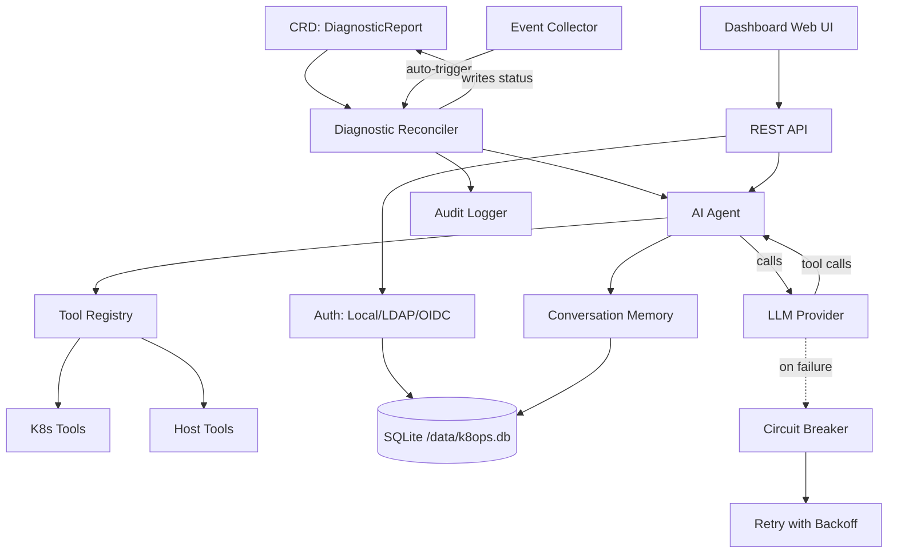

# k8ops Architecture

## Overview

k8ops is a Kubernetes AIOps operator that uses AI agents to diagnose cluster issues, suggest optimizations, and execute remediations. It runs as an in-cluster controller with an embedded web dashboard.

## Six-Layer Architecture

```
┌─────────────────────────────────────────────────────────────┐
│                    Dashboard Layer                          │
│  Embedded Web UI + REST API (port :9090)                    │
│  dashboard/server.go                                        │
├─────────────────────────────────────────────────────────────┤
│                    Service Layer                            │
│  auth · chat · provider · providermanager · metrics ·       │
│  audit · memory · collector · resilience · safety           │
├─────────────────────────────────────────────────────────────┤
│                    Agent Layer                              │
│  Observe → Think → Act loop (agent/agent.go)                │
│  Max 15 steps, 180s timeout, tool-calling LLM               │
├─────────────────────────────────────────────────────────────┤
│                    Controller Layer                         │
│  diagnostic · optimization · remediation reconcilers        │
│  Watches CRDs, triggers Agent, writes results back          │
├─────────────────────────────────────────────────────────────┤
│                    Tool Layer                               │
│  tools/k8s (get/describe/logs/exec/top)                     │
│  tools/host (process, dmesg) · tools/remediation            │
│  tools/registry.go — thread-safe tool registry              │
├─────────────────────────────────────────────────────────────┤
│                    API Layer (CRD Types)                    │
│  api/v1alpha1: DiagnosticReport, OptimizationSuggestion,   │
│  RemediationPlan, K8opsConfig                              │
└─────────────────────────────────────────────────────────────┘
```

## Component Relationships



## Data Flow

### Automated Diagnostic Flow

```
1. Kubernetes Event (e.g., Pod CrashLoopBackOff)
   ↓
2. Event Collector detects anomaly
   ↓
3. Controller creates DiagnosticReport CRD
   ↓
4. Diagnostic Reconciler picks up CRD
   ↓
5. Agent launches Observe→Think→Act loop:
   a. Observe: collects events, logs, resource state via tools
   b. Think: sends context to LLM with tool definitions
   c. Act: executes tool calls (kubectl describe, logs, etc.)
   d. Loop: feeds results back (max 15 steps, 180s timeout)
   ↓
6. Agent writes analysis + recommendations to CRD status
   ↓
7. Dashboard displays results in Web UI
```

### Interactive Chat Flow

```
1. User authenticates (Local/LDAP/OIDC) → JWT token
   ↓
2. User sends message via Dashboard /api/chat (SSE)
   ↓
3. Chat Engine creates/reuses Conversation (memory layer)
   ↓
4. Provider Manager selects active LLM provider
   ↓
5. Agent loop: LLM ↔ Tools (with retry + circuit breaker)
   ↓
6. Streaming response via SSE to browser
   ↓
7. Conversation stored with TTL cleanup (30min idle, 1000 cap)
```

### Resilience

- **Retry**: 5 attempts, exponential backoff (1s→30s, 2x multiplier)
- **Circuit Breaker**: opens after 5 consecutive failures, 60s cooldown
- **Retryable errors**: 429, 500, 502, 503, timeout, connection errors
- **Non-retryable**: 400, 401, 403, 404

## Deployment Architecture

```
┌──────────────────────────────────────────┐
│           k8ops Pod                       │
│                                           │
│  ┌─────────────┐  ┌──────────────────┐   │
│  │  Manager     │  │  Dashboard       │   │
│  │  (controller)│  │  (web :9090)     │   │
│  └──────┬───────┘  └────────┬─────────┘   │
│         │                   │              │
│  ┌──────┴───────────────────┴─────────┐   │
│  │         SQLite (/data/k8ops.db)    │   │
│  └────────────────────────────────────┘   │
│                                           │
│  ┌────────────────────────────────────┐   │
│  │  PVC (k8ops-data, 1Gi)             │   │
│  │  mounted at: /data                 │   │
│  └────────────────────────────────────┘   │
└──────────────────────────────────────────┘
         │                    │
    ┌────┴────┐         ┌────┴────┐
    │ K8s API │         │ LLM API │
    │ (in-cluster) │    │ (egress)│
    └─────────┘         └─────────┘
```

## Deployment Modes

### Deployment Mode (Default)

单 Pod 运行，通过 PVC 持久化数据。适合大多数场景。

```
┌──────────────────────────────────────────┐
│           k8ops Pod (1 replica)           │
│                                           │
│  ┌─────────────┐  ┌──────────────────┐   │
│  │  Manager     │  │  Dashboard       │   │
│  │  (controller)│  │  (web :9090)     │   │
│  └──────┬───────┘  └────────┬─────────┘   │
│         │                   │              │
│  ┌──────┴───────────────────┴─────────┐   │
│  │         SQLite (/data/k8ops.db)    │   │
│  └────────────────────────────────────┘   │
│                                           │
│  ┌────────────────────────────────────┐   │
│  │  PVC (k8ops-data, 1Gi)             │   │
│  │  mounted at: /data                 │   │
│  └────────────────────────────────────┘   │
└──────────────────────────────────────────┘
         │                    │
    ┌────┴────┐         ┌────┴────┐
    │ K8s API │         │ LLM API │
    └─────────┘         └─────────┘
```

### DaemonSet Mode (Per-Node)

每个节点运行一个 Pod，支持节点级诊断。数据存储在 hostPath（每节点独立）。

```
┌─────────── Node 1 ───────────┐  ┌─────────── Node 2 ───────────┐
│  k8ops Pod (hostPath data)    │  │  k8ops Pod (hostPath data)    │
│  ├── Manager + Dashboard      │  │  ├── Manager + Dashboard      │
│  ├── SQLite (/var/lib/k8ops)  │  │  ├── SQLite (/var/lib/k8ops)  │
│  └── Host mount (/host ro)    │  │  └── Host mount (/host ro)    │
└───────────────────────────────┘  └───────────────────────────────┘
         │                    │
    ┌────┴────┐         ┌────┴────┐
    │ K8s API │         │ LLM API │
    └─────────┘         └─────────┘
```

DaemonSet 模式特点：
- `tolerations: Exists` — 在所有节点运行（包括 tainted 节点）
- `hostPath: /var/lib/k8ops` — 每节点独立 SQLite 数据
- `hostPath: /` (readOnly) — 只读访问主机文件系统用于诊断
- `hostPath: /var/run` — 访问容器运行时 socket
- Service 通过 label selector 自动发现各节点 Pod

### Data Storage

| Store | Location | Purpose |
|-------|----------|---------|
| SQLite | `/data/k8ops.db` (PVC-backed) | Users, AuthProviders, RoleDefs, conversations |
| K8s CRDs | API server | DiagnosticReports, OptimizationSuggestions, RemediationPlans |
| K8s Secrets | API server | JWT signing key, provider credentials |
| K8s RBAC | API server | RoleBindings for namespace-scoped users |

### Key Design Decisions

1. **Channel-driven event loop** — single goroutine owns all chat state, events delivered via channels
2. **Embedded web UI** — `go:embed web/*` serves SPA from binary, no separate frontend deployment
3. **SQLite over external DB** — simplifies ops, PVC-backed for persistence, WAL mode for concurrency
4. **CRD as source of truth** — diagnostics/optimizations/remediations stored as K8s resources
5. **Tool registry** — thread-safe (`sync.RWMutex`), tools registered at startup, extensible
6. **Provider abstraction** — `provider.Provider` interface supports OpenAI, Anthropic, Gemini, custom endpoints
7. **Impersonation** — API calls to K8s use user-specific identity for RBAC enforcement

## Building & Running

```bash
# Build
make build              # → bin/manager, bin/k8ops

# Run locally
make run PROVIDER_TYPE=openai PROVIDER_MODEL=gpt-4o

# Deploy to cluster
make deploy

# Docker
make docker-build IMG=ghcr.io/ggai/k8ops:latest
```

## Configuration

| Flag | Env Var | Default | Description |
|------|---------|---------|-------------|
| `--metrics-bind-address` | — | `:8080` | Prometheus metrics |
| `--health-probe-bind-address` | — | `:8081` | Liveness/readiness |
| `--dashboard-address` | — | `:9090` | Web UI + API |
| `--provider-type` | — | `openai` | LLM provider |
| `--provider-model` | — | — | Model name |
| `--provider-api-key` | `AIOPS_API_KEY` | — | LLM API key |
| `--auth-db-path` | `AUTH_DB_PATH` | `/data/k8ops.db` | SQLite path |
| `--auth-jwt-secret` | `AUTH_JWT_SECRET` | (random) | JWT signing key |
| — | `CORS_ALLOWED_ORIGINS` | — | Comma-separated allowed origins |
