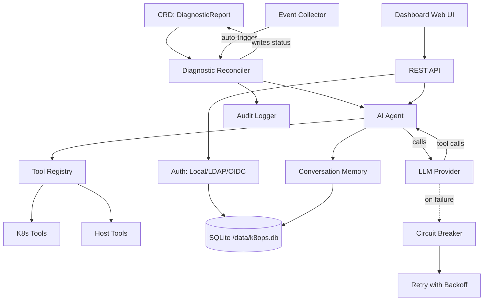

# k8ops Architektur

## Übersicht

k8ops ist ein Kubernetes-AIOps-Operator, der KI-Agenten einsetzt, um Cluster-Probleme zu diagnostizieren, Optimierungsvorschläge zu machen und Behebungen auszuführen. Er läuft als In-Cluster-Controller mit einem integrierten Web-Dashboard.

## Sechsschichtige Architektur

```
┌─────────────────────────────────────────────────────────────┐
│                    Dashboard-Ebene                           │
│  Eingebettete Web-UI + REST-API (Port :9090)                │
│  dashboard/server.go                                        │
├─────────────────────────────────────────────────────────────┤
│                    Service-Ebene                             │
│  auth · chat · provider · providermanager · metrics ·       │
│  audit · memory · collector · resilience · safety           │
├─────────────────────────────────────────────────────────────┤
│                    Agent-Ebene                               │
│  Beobachten→Denken→Handeln-Schleife (agent/agent.go)     │
│  Max 15 Schritte, 180s Timeout, Tool-aufrufendes LLM        │
├─────────────────────────────────────────────────────────────┤
│                    Controller-Ebene                          │
│  diagnostic · optimization · remediation Reconciler         │
│  Überwacht CRDs, startet Agent, schreibt Ergebnisse zurück  │
├─────────────────────────────────────────────────────────────┤
│                    Tool-Ebene                                │
│  tools/k8s (get/describe/logs/exec/top)                     │
│  tools/host (process, dmesg) · tools/remediation            │
│  tools/registry.go — Thread-sichere Tool-Registry           │
├─────────────────────────────────────────────────────────────┤
│                    API-Ebene (CRD-Typen)                     │
│  api/v1alpha1: DiagnosticReport, OptimizationSuggestion,   │
│  RemediationPlan, K8opsConfig                              │
└─────────────────────────────────────────────────────────────┘
```

## Komponentenbeziehungen



## Datenfluss

### Automatisierter Diagnosefluss

```
1. Kubernetes-Ereignis (z.B. Pod CrashLoopBackOff)
   ↓
2. Event Collector erkennt Anomalie
   ↓
3. Controller erstellt DiagnosticReport CRD
   ↓
4. Diagnostic Reconciler übernimmt CRD
   ↓
5. Agent startet die Beobachten→Denken→Handeln-Schleife:
   a. Beobachten: sammelt Ereignisse, Logs, Ressourcenzustand über Tools
   b. Denken: sendet Kontext an LLM mit Tool-Definitionen
   c. Handeln: führt Tool-Aufrufe aus (kubectl describe, logs, etc.)
   d. Schleife: führt Ergebnisse zurück (max 15 Schritte, 180s Timeout)
   ↓
6. Agent schreibt Analyse + Empfehlungen in CRD-Status
   ↓
7. Dashboard zeigt Ergebnisse in der Web-UI
```

### Interaktiver Chat-Fluss

```
1. Benutzer authentifiziert sich (Local/LDAP/OIDC) → JWT-Token
   ↓
2. Benutzer sendet Nachricht über Dashboard /api/chat (SSE)
   ↓
3. Chat-Engine erstellt/wiederverwendet Konversation (Memory-Ebene)
   ↓
4. Provider Manager wählt aktiven LLM-Provider
   ↓
5. Agent-Schleife: LLM ↔ Tools (mit Retry + Circuit Breaker)
   ↓
6. Streaming-Antwort via SSE zum Browser
   ↓
7. Konversation gespeichert mit TTL-Bereinigung (30min Inaktiv, 1000 max.)
```

### Resilienz

- **Retry**: 5 Versuche, exponentielles Backoff (1s→30s, 2x Multiplikator)
- **Circuit Breaker**: öffnet nach 5 aufeinanderfolgenden Fehlern, 60s Abkühlphase
- **Wiederholbare Fehler**: 429, 500, 502, 503, Timeout, Verbindungsfehler
- **Nicht wiederholbar**: 400, 401, 403, 404

## Bereitstellungsarchitektur

```
┌──────────────────────────────────────────┐
│           k8ops Pod                       │
│                                           │
│  ┌─────────────┐  ┌──────────────────┐   │
│  │  Manager     │  │  Dashboard       │   │
│  │  (controller)│  │  (web :9090)     │   │
│  └──────┬───────┘  └────────┬─────────┘   │
│         │                   │              │
│  ┌──────┴───────────────────┴─────────┐   │
│  │         SQLite (/data/k8ops.db)    │   │
│  └────────────────────────────────────┘   │
│                                           │
│  ┌────────────────────────────────────┐   │
│  │  PVC (k8ops-data, 1Gi)             │   │
│  │  eingehängt unter: /data           │   │
│  └────────────────────────────────────┘   │
└──────────────────────────────────────────┘
         │                    │
    ┌────┴────┐         ┌────┴────┐
    │ K8s API │         │ LLM API │
    │ (in-cluster) │    │ (egress)│
    └─────────┘         └─────────┘
```

## Bereitstellungsmodi

### Deployment-Modus (Standard)

Einzelner Pod, Daten über PVC persistent gespeichert. Geeignet für die meisten Szenarien.

```
┌──────────────────────────────────────────┐
│           k8ops Pod (1 Replika)          │
│                                           │
│  ┌─────────────┐  ┌──────────────────┐   │
│  │  Manager     │  │  Dashboard       │   │
│  │  (controller)│  │  (web :9090)     │   │
│  └──────┬───────┘  └────────┬─────────┘   │
│         │                   │              │
│  ┌──────┴───────────────────┴─────────┐   │
│  │         SQLite (/data/k8ops.db)    │   │
│  └────────────────────────────────────┘   │
│                                           │
│  ┌────────────────────────────────────┐   │
│  │  PVC (k8ops-data, 1Gi)             │   │
│  │  eingehängt unter: /data           │   │
│  └────────────────────────────────────┘   │
└──────────────────────────────────────────┘
         │                    │
    ┌────┴────┐         ┌────┴────┐
    │ K8s API │         │ LLM API │
    └─────────┘         └─────────┘
```

### DaemonSet-Modus (Pro Knoten)

Ein Pod pro Knoten, unterstützt knotenbezogene Diagnose. Daten werden in hostPath gespeichert (jeder Knoten unabhängig).

```
┌─────────── Node 1 ───────────┐  ┌─────────── Node 2 ───────────┐
│  k8ops Pod (hostPath data)    │  │  k8ops Pod (hostPath data)    │
│  ├── Manager + Dashboard      │  │  ├── Manager + Dashboard      │
│  ├── SQLite (/var/lib/k8ops)  │  │  ├── SQLite (/var/lib/k8ops)  │
│  └── Host mount (/host ro)    │  │  └── Host mount (/host ro)    │
└───────────────────────────────┘  └───────────────────────────────┘
         │                    │
    ┌────┴────┐         ┌────┴────┐
    │ K8s API │         │ LLM API │
    └─────────┘         └─────────┘
```

DaemonSet-Modus-Merkmale:
- `tolerations: Exists` — läuft auf allen Knoten (einschließlich getainter Knoten)
- `hostPath: /var/lib/k8ops` — unabhängige SQLite-Daten pro Knoten
- `hostPath: /` (readOnly) — Lesezugriff auf das Host-Dateisystem zur Diagnose
- `hostPath: /var/run` — Zugriff auf den Container-Runtime-Socket
- Service erkennt automatisch jeden Knoten-Pod über Label-Selector

### Datenspeicherung

| Speicher | Ort | Zweck |
|----------|-----|-------|
| SQLite | `/data/k8ops.db` (PVC-gestützt) | Benutzer, AuthProvider, RoleDefs, Konversationen |
| K8s CRDs | API-Server | DiagnosticReports, OptimizationSuggestions, RemediationPlans |
| K8s Secrets | API-Server | JWT-Signierschlüssel, Provider-Anmeldedaten |
| K8s RBAC | API-Server | RoleBindings für Namespace-bezogene Benutzer |

### Wichtige Designentscheidungen

1. **Channel-gesteuerte Ereignisschleife** — eine einzelne Goroutine besitzt den gesamten Chat-Zustand, Ereignisse werden über Channels zugestellt
2. **Eingebettete Web-UI** — `go:embed web/*` bedient SPA aus der Binärdatei, keine separate Frontend-Bereitstellung
3. **SQLite statt externer DB** — vereinfacht den Betrieb, PVC-gestützt für Persistenz, WAL-Modus für Nebenläufigkeit
4. **CRD als Quelle der Wahrheit** — Diagnosen/Optimierungen/Behebungen werden als K8s-Ressourcen gespeichert
5. **Tool-Registry** — Thread-sicher (`sync.RWMutex`), Tools beim Start registriert, erweiterbar
6. **Provider-Abstraktion** — `provider.Provider`-Schnittstelle unterstützt OpenAI, Anthropic, Gemini, benutzerdefinierte Endpunkte
7. **Identitätswechsel (Impersonation)** — API-Aufrufe an K8s verwenden benutzerspezifische Identität zur RBAC-Durchsetzung
8. **Anfrageverfolgung** — jede Anfrage erhält eine `X-Request-ID` (automatisch generiert oder weitergeleitet), ermöglicht Log-Korrelation
9. **HTTP-Metriken** — Prometheus verfolgt Anfrageanzahl, Latenz-Histogramm, In-Flight-Gauge und Fehlerrate pro Endpunkt
10. **Pfad-Normalisierung** — `/api/pods/{ns}/{name}/logs`-Vorlage reduziert Metrik-Kardinalität

## Erstellen und Ausführen

```bash
# Build
make build              # → bin/manager, bin/k8ops

# Lokal ausführen
make run PROVIDER_TYPE=openai PROVIDER_MODEL=gpt-4o

# Im Cluster bereitstellen
make deploy

# Docker
make docker-build IMG=ghcr.io/ggai/k8ops:latest
```

## Konfiguration

| Flag | Umgebungsvariable | Standardwert | Beschreibung |
|------|-------------------|-------------|--------------|
| `--metrics-bind-address` | — | `:8080` | Prometheus-Metriken |
| `--health-probe-bind-address` | — | `:8081` | Liveness/Readiness |
| `--dashboard-address` | — | `:9090` | Web-UI + API |
| `--provider-type` | — | `openai` | LLM-Provider |
| `--provider-model` | — | — | Modellname |
| `--provider-api-key` | `AIOPS_API_KEY` | — | LLM-API-Schlüssel |
| `--auth-db-path` | `AUTH_DB_PATH` | `/data/k8ops.db` | SQLite-Pfad |
| `--auth-jwt-secret` | `AUTH_JWT_SECRET` | (zufällig) | JWT-Signierschlüssel |
| — | `CORS_ALLOWED_ORIGINS` | — | Kommagetrennte erlaubte Ursprünge |
