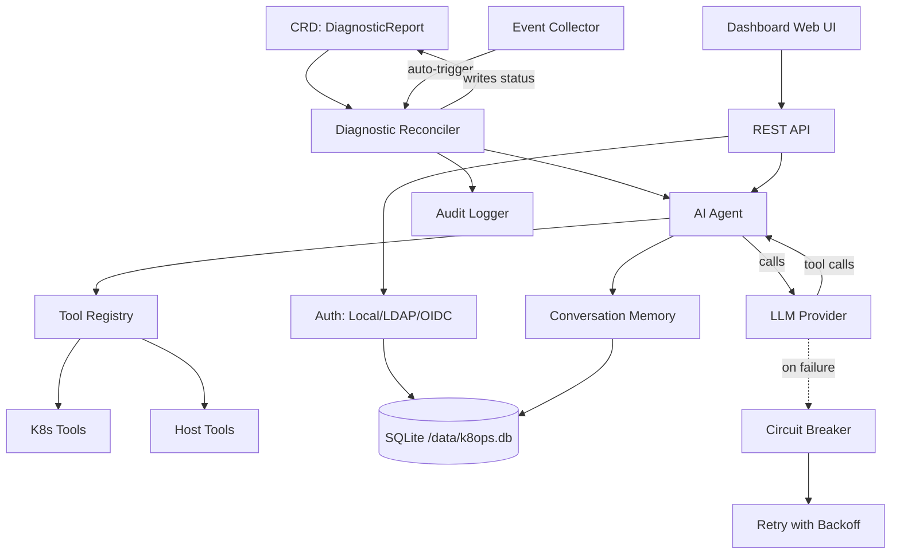

# Arquitectura de k8ops

## Descripción General

k8ops es un operador AIOps de Kubernetes que utiliza agentes de IA para diagnosticar problemas del clúster, sugerir optimizaciones y ejecutar remediaciones. Se ejecuta como un controlador dentro del clúster con un dashboard web integrado.

## Arquitectura de Seis Capas

```
┌─────────────────────────────────────────────────────────────┐
│                    Capa de Dashboard                         │
│  Web UI integrada + REST API (puerto :9090)                 │
│  dashboard/server.go                                        │
├─────────────────────────────────────────────────────────────┤
│                    Capa de Servicio                          │
│  auth · chat · provider · providermanager · metrics ·       │
│  audit · memory · collector · resilience · safety           │
├─────────────────────────────────────────────────────────────┤
│                    Capa de Agente                            │
│  Bucle Observar → Pensar → Actuar (agent/agent.go)          │
│  Máx 15 pasos, 180s de tiempo de espera, LLM con llamadas   │
├─────────────────────────────────────────────────────────────┤
│                    Capa de Controlador                       │
│  reconciliadores de diagnóstico · optimización · remediación │
│  Observa CRDs, dispara el Agente, escribe resultados        │
├─────────────────────────────────────────────────────────────┤
│                    Capa de Herramientas                      │
│  tools/k8s (get/describe/logs/exec/top)                     │
│  tools/host (process, dmesg) · tools/remediation            │
│  tools/registry.go — registro de herramientas thread-safe   │
├─────────────────────────────────────────────────────────────┤
│                    Capa de API (Tipos CRD)                   │
│  api/v1alpha1: DiagnosticReport, OptimizationSuggestion,   │
│  RemediationPlan, K8opsConfig                              │
└─────────────────────────────────────────────────────────────┘
```

## Relaciones entre Componentes



## Flujo de Datos

### Flujo de Diagnóstico Automatizado

```
1. Evento de Kubernetes (p. ej., Pod CrashLoopBackOff)
   ↓
2. El Event Collector detecta la anomalía
   ↓
3. El Controller crea el CRD DiagnosticReport
   ↓
4. El Diagnostic Reconciler recoge el CRD
   ↓
5. El Agente inicia el bucle Observar→Pensar→Actuar:
   a. Observar: recopila eventos, logs, estado de recursos mediante herramientas
   b. Pensar: envía el contexto al LLM con las definiciones de herramientas
   c. Actuar: ejecuta llamadas de herramientas (kubectl describe, logs, etc.)
   d. Bucle: retroalimenta los resultados (máx 15 pasos, 180s de tiempo de espera)
   ↓
6. El Agente escribe el análisis + recomendaciones en el estado del CRD
   ↓
7. El Dashboard muestra los resultados en la Web UI
```

### Flujo de Chat Interactivo

```
1. El usuario se autentica (Local/LDAP/OIDC) → token JWT
   ↓
2. El usuario envía un mensaje vía Dashboard /api/chat (SSE)
   ↓
3. El Motor de Chat crea/reutiliza la Conversación (capa de memoria)
   ↓
4. El Provider Manager selecciona el proveedor LLM activo
   ↓
5. Bucle del Agente: LLM ↔ Herramientas (con reintentos + circuit breaker)
   ↓
6. Respuesta en streaming vía SSE al navegador
   ↓
7. Conversación almacenada con limpieza por TTL (30min inactivo, 1000 máximo)
```

### Resiliencia

- **Reintentos**: 5 intentos, backoff exponencial (1s→30s, multiplicador 2x)
- **Circuit Breaker**: se abre tras 5 fallos consecutivos, 60s de enfriamiento
- **Errores recuperables**: 429, 500, 502, 503, timeout, errores de conexión
- **No recuperables**: 400, 401, 403, 404

## Arquitectura de Despliegue

```
┌──────────────────────────────────────────┐
│           k8ops Pod                       │
│                                           │
│  ┌─────────────┐  ┌──────────────────┐   │
│  │  Manager     │  │  Dashboard       │   │
│  │  (controller)│  │  (web :9090)     │   │
│  └──────┬───────┘  └────────┬─────────┘   │
│         │                   │              │
│  ┌──────┴───────────────────┴─────────┐   │
│  │         SQLite (/data/k8ops.db)    │   │
│  └────────────────────────────────────┘   │
│                                           │
│  ┌────────────────────────────────────┐   │
│  │  PVC (k8ops-data, 1Gi)             │   │
│  │  montado en: /data                 │   │
│  └────────────────────────────────────┘   │
└──────────────────────────────────────────┘
         │                    │
    ┌────┴────┐         ┌────┴────┐
    │ K8s API │         │ LLM API │
    │ (in-cluster) │    │ (egress)│
    └─────────┘         └─────────┘
```

## Modos de Despliegue

### Modo Deployment (Predeterminado)

Ejecución en un solo Pod, con datos persistidos mediante PVC. Adecuado para la mayoría de los escenarios.

```
┌──────────────────────────────────────────┐
│           k8ops Pod (1 réplica)           │
│                                           │
│  ┌─────────────┐  ┌──────────────────┐   │
│  │  Manager     │  │  Dashboard       │   │
│  │  (controller)│  │  (web :9090)     │   │
│  └──────┬───────┘  └────────┬─────────┘   │
│         │                   │              │
│  ┌──────┴───────────────────┴─────────┐   │
│  │         SQLite (/data/k8ops.db)    │   │
│  └────────────────────────────────────┘   │
│                                           │
│  ┌────────────────────────────────────┐   │
│  │  PVC (k8ops-data, 1Gi)             │   │
│  │  montado en: /data                 │   │
│  └────────────────────────────────────┘   │
└──────────────────────────────────────────┘
         │                    │
    ┌────┴────┐         ┌────┴────┐
    │ K8s API │         │ LLM API │
    └─────────┘         └─────────┘
```

### Modo DaemonSet (Por Nodo)

Un Pod se ejecuta en cada nodo, soportando diagnóstico a nivel de nodo. Los datos se almacenan en hostPath (independiente por nodo).

```
┌─────────── Node 1 ───────────┐  ┌─────────── Node 2 ───────────┐
│  k8ops Pod (hostPath data)    │  │  k8ops Pod (hostPath data)    │
│  ├── Manager + Dashboard      │  │  ├── Manager + Dashboard      │
│  ├── SQLite (/var/lib/k8ops)  │  │  ├── SQLite (/var/lib/k8ops)  │
│  └── Host mount (/host ro)    │  │  └── Host mount (/host ro)    │
└───────────────────────────────┘  └───────────────────────────────┘
         │                    │
    ┌────┴────┐         ┌────┴────┐
    │ K8s API │         │ LLM API │
    └─────────┘         └─────────┘
```

Características del modo DaemonSet:
- `tolerations: Exists` — se ejecuta en todos los nodos (incluidos los taintados)
- `hostPath: /var/lib/k8ops` — datos SQLite independientes por nodo
- `hostPath: /` (readOnly) — acceso de solo lectura al sistema de archivos del host para diagnóstico
- `hostPath: /var/run` — acceso al socket del runtime de contenedores
- El Service descubre automáticamente los Pods de cada nodo mediante label selector

### Almacenamiento de Datos

| Almacén | Ubicación | Propósito |
|-------|----------|----------|
| SQLite | `/data/k8ops.db` (respaldado por PVC) | Usuarios, AuthProviders, RoleDefs, conversaciones |
| CRDs de K8s | API server | DiagnosticReports, OptimizationSuggestions, RemediationPlans |
| Secrets de K8s | API server | Clave de firma JWT, credenciales del proveedor |
| RBAC de K8s | API server | RoleBindings para usuarios con ámbito de namespace |

### Decisiones Clave de Diseño

1. **Bucle de eventos basado en canales** — una sola goroutine posee todo el estado del chat, los eventos se entregan mediante canales
2. **Web UI integrada** — `go:embed web/*` sirve el SPA desde el binario, sin despliegue de frontend separado
3. **SQLite sobre BD externa** — simplifica las operaciones, respaldado por PVC para persistencia, modo WAL para concurrencia
4. **CRD como fuente de verdad** — diagnósticos/optimizaciones/remediaciones almacenados como recursos de K8s
5. **Registro de herramientas** — thread-safe (`sync.RWMutex`), herramientas registradas al inicio, extensible
6. **Abstracción de proveedor** — la interfaz `provider.Provider` soporta OpenAI, Anthropic, Gemini y endpoints personalizados
7. **Suplantación** — las llamadas a la API de K8s utilizan la identidad específica del usuario para el cumplimiento de RBAC
8. **Trazabilidad de solicitudes** — cada solicitud recibe un `X-Request-ID` (auto-generado o propagado), permitiendo correlación de logs
9. **Métricas HTTP** — Prometheus rastrea recuento de solicitudes, histograma de latencia, medidor en vuelo y tasa de error por endpoint
10. **Normalización de rutas** — la plantilla `/api/pods/{ns}/{name}/logs` reduce la cardinalidad de métricas

## Compilación y Ejecución

```bash
# Compilar
make build              # → bin/manager, bin/k8ops

# Ejecutar localmente
make run PROVIDER_TYPE=openai PROVIDER_MODEL=gpt-4o

# Desplegar en el clúster
make deploy

# Docker
make docker-build IMG=ghcr.io/ggai/k8ops:latest
```

## Configuración

| Flag | Variable de Entorno | Predeterminado | Descripción |
|------|---------|---------|-------------|
| `--metrics-bind-address` | — | `:8080` | Métricas de Prometheus |
| `--health-probe-bind-address` | — | `:8081` | Liveness/readiness |
| `--dashboard-address` | — | `:9090` | Web UI + API |
| `--provider-type` | — | `openai` | Proveedor LLM |
| `--provider-model` | — | — | Nombre del modelo |
| `--provider-api-key` | `AIOPS_API_KEY` | — | LLM API key |
| `--auth-db-path` | `AUTH_DB_PATH` | `/data/k8ops.db` | Ruta de SQLite |
| `--auth-jwt-secret` | `AUTH_JWT_SECRET` | (aleatorio) | Clave de firma JWT |
| — | `CORS_ALLOWED_ORIGINS` | — | Orígenes permitidos separados por comas |
