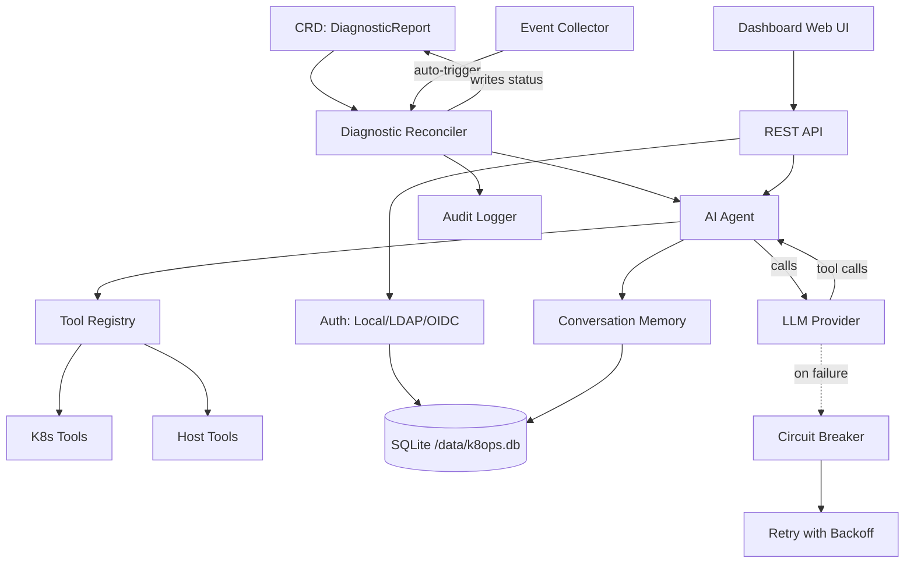

# Architecture de k8ops

## Vue d'ensemble

k8ops est un opérateur Kubernetes AIOps qui utilise des agents IA pour diagnostiquer les problèmes de cluster, suggérer des optimisations et exécuter des remédiations. Il fonctionne comme un contrôleur au sein du cluster avec un tableau de bord web intégré.

## Architecture à six couches

```
┌─────────────────────────────────────────────────────────────┐
│                    Couche Tableau de bord                    │
│  Interface Web intégrée + API REST (port :9090)             │
│  dashboard/server.go                                        │
├─────────────────────────────────────────────────────────────┤
│                    Couche Services                          │
│  auth · chat · provider · providermanager · metrics ·       │
│  audit · memory · collector · resilience · safety           │
├─────────────────────────────────────────────────────────────┤
│                    Couche Agent                             │
│  Boucle Observer → Réfléchir → Agir (agent/agent.go)        │
│  15 étapes max, délai 180s, LLM avec appel d'outils         │
├─────────────────────────────────────────────────────────────┤
│                    Couche Contrôleur                        │
│  Reconcilers diagnostic · optimisation · remédiation        │
│  Surveille les CRD, déclenche l'Agent, écrit les résultats  │
├─────────────────────────────────────────────────────────────┤
│                    Couche Outils                            │
│  tools/k8s (get/describe/logs/exec/top)                     │
│  tools/host (process, dmesg) · tools/remediation            │
│  tools/registry.go — registre d'outils thread-safe          │
├─────────────────────────────────────────────────────────────┤
│                    Couche API (Types CRD)                   │
│  api/v1alpha1: DiagnosticReport, OptimizationSuggestion,   │
│  RemediationPlan, K8opsConfig                              │
└─────────────────────────────────────────────────────────────┘
```

## Relations entre les composants



## Flux de données

### Flux de diagnostic automatisé

```
1. Événement Kubernetes (ex. Pod CrashLoopBackOff)
   ↓
2. Le collecteur d'événements détecte une anomalie
   ↓
3. Le contrôleur crée la CRD DiagnosticReport
   ↓
4. Le reconciler de diagnostic prend en charge la CRD
   ↓
5. L'agent lance la boucle Observer → Réfléchir → Agir :
   a. Observer : collecte les événements, journaux, état des ressources via les outils
   b. Réfléchir : envoie le contexte au LLM avec les définitions d'outils
   c. Agir : exécute les appels d'outils (kubectl describe, logs, etc.)
   d. Boucle : renvoie les résultats (15 étapes max, délai 180s)
   ↓
6. L'agent écrit l'analyse + les recommandations dans le statut de la CRD
   ↓
7. Le tableau de bord affiche les résultats dans l'interface Web
```

### Flux de chat interactif

```
1. L'utilisateur s'authentifie (Local/LDAP/OIDC) → jeton JWT
   ↓
2. L'utilisateur envoie un message via le Dashboard /api/chat (SSE)
   ↓
3. Le moteur de chat crée/réutilise une conversation (couche mémoire)
   ↓
4. Le gestionnaire de providers sélectionne le provider LLM actif
   ↓
5. Boucle de l'agent : LLM ↔ Outils (avec retry + circuit breaker)
   ↓
6. Réponse en streaming via SSE vers le navigateur
   ↓
7. Conversation stockée avec nettoyage TTL (30min d'inactivité, plafond 1000)
```

### Résilience

- **Retry** : 5 tentatives, backoff exponentiel (1s→30s, multiplicateur 2x)
- **Circuit Breaker** : s'ouvre après 5 échecs consécutifs, 60s de récupération
- **Erreurs retentables** : 429, 500, 502, 503, timeout, erreurs de connexion
- **Non retentables** : 400, 401, 403, 404

## Architecture de déploiement

```
┌──────────────────────────────────────────┐
│           Pod k8ops                       │
│                                           │
│  ┌─────────────┐  ┌──────────────────┐   │
│  │  Manager     │  │  Dashboard       │   │
│  │  (controller)│  │  (web :9090)     │   │
│  └──────┬───────┘  └────────┬─────────┘   │
│         │                   │              │
│  ┌──────┴───────────────────┴─────────┐   │
│  │         SQLite (/data/k8ops.db)    │   │
│  └────────────────────────────────────┘   │
│                                           │
│  ┌────────────────────────────────────┐   │
│  │  PVC (k8ops-data, 1Gi)             │   │
│  │  monté sur : /data                 │   │
│  └────────────────────────────────────┘   │
└──────────────────────────────────────────┘
         │                    │
    ┌────┴────┐         ┌────┴────┐
    │ K8s API │         │ LLM API │
    │ (in-cluster) │    │ (egress)│
    └─────────┘         └─────────┘
```

## Modes de déploiement

### Mode déploiement (par défaut)

Fonctionnement en Pod unique, avec persistance des données via PVC. Adapté à la plupart des scénarios.

```
┌──────────────────────────────────────────┐
│           Pod k8ops (1 replica)           │
│                                           │
│  ┌─────────────┐  ┌──────────────────┐   │
│  │  Manager     │  │  Dashboard       │   │
│  │  (controller)│  │  (web :9090)     │   │
│  └──────┬───────┘  └────────┬─────────┘   │
│         │                   │              │
│  ┌──────┴───────────────────┴─────────┐   │
│  │         SQLite (/data/k8ops.db)    │   │
│  └────────────────────────────────────┘   │
│                                           │
│  ┌────────────────────────────────────┐   │
│  │  PVC (k8ops-data, 1Gi)             │   │
│  │  monté sur : /data                 │   │
│  └────────────────────────────────────┘   │
└──────────────────────────────────────────┘
         │                    │
    ┌────┴────┐         ┌────┴────┐
    │ K8s API │         │ LLM API │
    └─────────┘         └─────────┘
```

### Mode DaemonSet (par nœud)

Un Pod par nœud, prenant en charge les diagnostics au niveau du nœud. Les données sont stockées en hostPath (indépendant par nœud).

```
┌─────────── Node 1 ───────────┐  ┌─────────── Node 2 ───────────┐
│  k8ops Pod (hostPath data)    │  │  k8ops Pod (hostPath data)    │
│  ├── Manager + Dashboard      │  │  ├── Manager + Dashboard      │
│  ├── SQLite (/var/lib/k8ops)  │  │  ├── SQLite (/var/lib/k8ops)  │
│  └── Host mount (/host ro)    │  │  └── Host mount (/host ro)    │
└───────────────────────────────┘  └───────────────────────────────┘
         │                    │
    ┌────┴────┐         ┌────┴────┐
    │ K8s API │         │ LLM API │
    └─────────┘         └─────────┘
```

Caractéristiques du mode DaemonSet :
- `tolerations: Exists` — s'exécute sur tous les nœuds (y compris les nœuds tainted)
- `hostPath: /var/lib/k8ops` — données SQLite indépendantes par nœud
- `hostPath: /` (readOnly) — accès en lecture seule au système de fichiers de l'hôte pour les diagnostics
- `hostPath: /var/run` — accès au socket du runtime de conteneurs
- Le Service découvre automatiquement les Pods de chaque nœud via les label selectors

### Stockage des données

| Stockage | Emplacement | Rôle |
|----------|-------------|------|
| SQLite | `/data/k8ops.db` (soutenu par PVC) | Utilisateurs, AuthProviders, RoleDefs, conversations |
| CRDs K8s | API server | DiagnosticReports, OptimizationSuggestions, RemediationPlans |
| Secrets K8s | API server | Clé de signature JWT, identifiants de provider |
| RBAC K8s | API server | RoleBindings pour les utilisateurs à portée de namespace |

### Décisions de conception clés

1. **Boucle d'événements pilotée par canaux** — une seule goroutine possède tout l'état du chat, les événements sont livrés via des canaux
2. **Interface Web intégrée** — `go:embed web/*` sert la SPA depuis le binaire, pas de déploiement frontend séparé
3. **SQLite plutôt qu'une base de données externe** — simplifie les opérations, soutenu par PVC pour la persistance, mode WAL pour la concurrence
4. **CRD comme source de vérité** — diagnostics/optimisations/remédiations stockés en tant que ressources K8s
5. **Registre d'outils** — thread-safe (`sync.RWMutex`), outils enregistrés au démarrage, extensible
6. **Abstraction de provider** — l'interface `provider.Provider` prend en charge OpenAI, Anthropic, Gemini, endpoints personnalisés
7. **Emprunt d'identité** — les appels API vers K8s utilisent l'identité spécifique à l'utilisateur pour l'application du RBAC
8. **Traçage des requêtes** — chaque requête reçoit un `X-Request-ID` (généré automatiquement ou propagé), permettant la corrélation des journaux
9. **Métriques HTTP** — Prometheus suit le nombre de requêtes, l'histogramme de latence, la jauge en cours et le taux d'erreur par endpoint
10. **Normalisation des chemins** — le modèle `/api/pods/{ns}/{name}/logs` réduit la cardinalité des métriques

## Compilation et exécution

```bash
# Compiler
make build              # → bin/manager, bin/k8ops

# Exécuter localement
make run PROVIDER_TYPE=openai PROVIDER_MODEL=gpt-4o

# Déployer sur le cluster
make deploy

# Docker
make docker-build IMG=ghcr.io/ggai/k8ops:latest
```

## Configuration

| Flag | Variable d'env | Défaut | Description |
|------|----------------|--------|-------------|
| `--metrics-bind-address` | — | `:8080` | Métriques Prometheus |
| `--health-probe-bind-address` | — | `:8081` | Liveness/readiness |
| `--dashboard-address` | — | `:9090` | Interface Web + API |
| `--provider-type` | — | `openai` | Provider LLM |
| `--provider-model` | — | — | Nom du modèle |
| `--provider-api-key` | `AIOPS_API_KEY` | — | Clé API LLM |
| `--auth-db-path` | `AUTH_DB_PATH` | `/data/k8ops.db` | Chemin SQLite |
| `--auth-jwt-secret` | `AUTH_JWT_SECRET` | (aléatoire) | Clé de signature JWT |
| — | `CORS_ALLOWED_ORIGINS` | — | Origines autorisées, séparées par des virgules |
