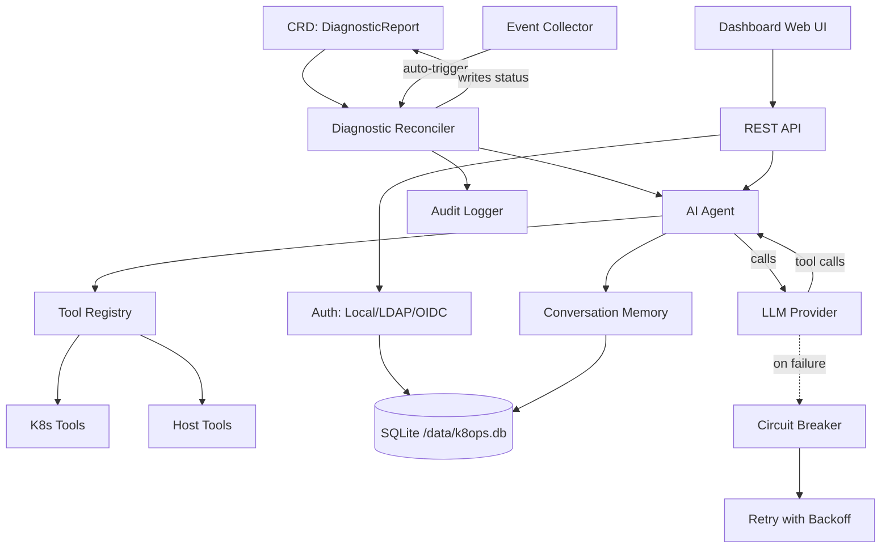

# k8ops アーキテクチャ

## 概要

k8ops は AI エージェントを使用してクラスターの問題を診断し、最適化を提案し、修復を実行する Kubernetes AIOps オペレーターです。クラスター内コントローラーとして、組み込みの Web ダッシュボードと共に動作します。

## 6 レイヤーアーキテクチャ

```
┌─────────────────────────────────────────────────────────────┐
│                    ダッシュボードレイヤー                     │
│  組み込み Web UI + REST API (port :9090)                     │
│  dashboard/server.go                                        │
├─────────────────────────────────────────────────────────────┤
│                    サービスレイヤー                          │
│  auth · chat · provider · providermanager · metrics ·       │
│  audit · memory · collector · resilience · safety           │
├─────────────────────────────────────────────────────────────┤
│                    エージェントレイヤー                      │
│  Observe → Think → Act ループ (agent/agent.go)              │
│  最大 15 ステップ、180s タイムアウト、ツール呼び出し LLM     │
├─────────────────────────────────────────────────────────────┤
│                    コントローラーレイヤー                    │
│  diagnostic · optimization · remediation reconcilers        │
│  CRD を監視、Agent をトリガー、結果を書き戻す                │
├─────────────────────────────────────────────────────────────┤
│                    ツールレイヤー                            │
│  tools/k8s (get/describe/logs/exec/top)                     │
│  tools/host (process, dmesg) · tools/remediation            │
│  tools/registry.go — スレッドセーフなツールレジストリ       │
├─────────────────────────────────────────────────────────────┤
│                    API レイヤー (CRD タイプ)                │
│  api/v1alpha1: DiagnosticReport, OptimizationSuggestion,   │
│  RemediationPlan, K8opsConfig                              │
└─────────────────────────────────────────────────────────────┘
```

## コンポーネントの関連



## データフロー

### 自動診断フロー

```
1. Kubernetes イベント（例: Pod CrashLoopBackOff）
   ↓
2. Event Collector が異常を検出
   ↓
3. Controller が DiagnosticReport CRD を作成
   ↓
4. Diagnostic Reconciler が CRD を取得
   ↓
5. Agent が Observe→Think→Act ループを起動:
   a. Observe: ツール経由でイベント、ログ、リソース状態を収集
   b. Think: ツール定義と共にコンテキストを LLM に送信
   c. Act: ツール呼び出しを実行（kubectl describe、ログなど）
   d. Loop: 結果をフィードバック（最大 15 ステップ、180s タイムアウト）
   ↓
6. Agent が分析結果と推奨事項を CRD ステータスに書き込み
   ↓
7. Dashboard が結果を Web UI に表示
```

### インタラクティブチャットフロー

```
1. ユーザー認証（Local/LDAP/OIDC）→ JWT トークン
   ↓
2. ユーザーが Dashboard の /api/chat (SSE) 経由でメッセージを送信
   ↓
3. Chat Engine が Conversation を作成/再利用（メモリレイヤー）
   ↓
4. Provider Manager がアクティブな LLM プロバイダーを選択
   ↓
5. Agent ループ: LLM ↔ Tools（リトライ + サーキットブレーカー付き）
   ↓
6. SSE 経由でブラウザにストリーミングレスポンス
   ↓
7. Conversation は TTL クリーンアップ付きで保存（30min アイドル、1000 上限）
```

### レジリエンス

- **リトライ**: 5 回、指数バックオフ（1s→30s、2x 倍率）
- **サーキットブレーカー**: 5 回連続失敗でオープン、60s クールダウン
- **リトライ可能エラー**: 429、500、502、503、タイムアウト、接続エラー
- **リトライ不可**: 400、401、403、404

## デプロイメントアーキテクチャ

```
┌──────────────────────────────────────────┐
│           k8ops Pod                       │
│                                           │
│  ┌─────────────┐  ┌──────────────────┐   │
│  │  Manager     │  │  Dashboard       │   │
│  │  (controller)│  │  (web :9090)     │   │
│  └──────┬───────┘  └────────┬─────────┘   │
│         │                   │              │
│  ┌──────┴───────────────────┴─────────┐   │
│  │         SQLite (/data/k8ops.db)    │   │
│  └────────────────────────────────────┘   │
│                                           │
│  ┌────────────────────────────────────┐   │
│  │  PVC (k8ops-data, 1Gi)             │   │
│  │  mounted at: /data                 │   │
│  └────────────────────────────────────┘   │
└──────────────────────────────────────────┘
         │                    │
    ┌────┴────┐         ┌────┴────┐
    │ K8s API │         │ LLM API │
    │ (in-cluster) │    │ (egress)│
    └─────────┘         └─────────┘
```

## デプロイメントモード

### Deployment モード（デフォルト）

単一 Pod で動作し、PVC でデータを永続化します。ほとんどのシナリオに適しています。

```
┌──────────────────────────────────────────┐
│           k8ops Pod (1 replica)           │
│                                           │
│  ┌─────────────┐  ┌──────────────────┐   │
│  │  Manager     │  │  Dashboard       │   │
│  │  (controller)│  │  (web :9090)     │   │
│  └──────┬───────┘  └────────┬─────────┘   │
│         │                   │              │
│  ┌──────┴───────────────────┴─────────┐   │
│  │         SQLite (/data/k8ops.db)    │   │
│  └────────────────────────────────────┘   │
│                                           │
│  ┌────────────────────────────────────┐   │
│  │  PVC (k8ops-data, 1Gi)             │   │
│  │  mounted at: /data                 │   │
│  └────────────────────────────────────┘   │
└──────────────────────────────────────────┘
         │                    │
    ┌────┴────┐         ┌────┴────┐
    │ K8s API │         │ LLM API │
    └─────────┘         └─────────┘
```

### DaemonSet モード（ノード単位）

各ノードで 1 つの Pod を実行し、ノードレベルの診断をサポートします。データは hostPath に保存されます（ノードごとに独立）。

```
┌─────────── Node 1 ───────────┐  ┌─────────── Node 2 ───────────┐
│  k8ops Pod (hostPath data)    │  │  k8ops Pod (hostPath data)    │
│  ├── Manager + Dashboard      │  │  ├── Manager + Dashboard      │
│  ├── SQLite (/var/lib/k8ops)  │  │  ├── SQLite (/var/lib/k8ops)  │
│  └── Host mount (/host ro)    │  │  └── Host mount (/host ro)    │
└───────────────────────────────┘  └───────────────────────────────┘
         │                    │
    ┌────┴────┐         ┌────┴────┐
    │ K8s API │         │ LLM API │
    └─────────┘         └─────────┘
```

DaemonSet モードの特徴：
- `tolerations: Exists` — すべてのノードで実行（taint 付きノードを含む）
- `hostPath: /var/lib/k8ops` — ノードごとに独立した SQLite データ
- `hostPath: /` (readOnly) — 診断用のホストファイルシステムへの読み取り専用アクセス
- `hostPath: /var/run` — コンテナランタイムソケットへのアクセス
- Service は label selector で各ノードの Pod を自動検出

### データストレージ

| ストア | 場所 | 用途 |
|-------|----------|---------|
| SQLite | `/data/k8ops.db` (PVC バックアップ) | Users、AuthProviders、RoleDefs、conversations |
| K8s CRDs | API server | DiagnosticReports、OptimizationSuggestions、RemediationPlans |
| K8s Secrets | API server | JWT 署名キー、プロバイダー認証情報 |
| K8s RBAC | API server | ネームスペーススコープユーザーの RoleBindings |

### 主要な設計決定

1. **チャネル駆動のイベントループ** — 単一の goroutine がすべてのチャット状態を所有、イベントはチャネル経由で配信
2. **組み込み Web UI** — `go:embed web/*` がバイナリから SPA を提供、別フロントエンドのデプロイ不要
3. **外部 DB ではなく SQLite** — 運用を簡素化、PVC で永続化、WAL モードで並行処理
4. **CRD を信頼の源として** — 診断/最適化/修復は K8s リソースとして保存
5. **ツールレジストリ** — スレッドセーフ（`sync.RWMutex`）、起動時にツールを登録、拡張可能
6. **プロバイダー抽象化** — `provider.Provider` インターフェースが OpenAI、Anthropic、Gemini、カスタムエンドポイントをサポート
7. **偽装 (Impersonation)** — K8s への API 呼び出しは RBAC 適用のためにユーザー固有の ID を使用
8. **リクエストトレーシング** — すべてのリクエストに `X-Request-ID`（自動生成または伝播）を付与、ログ相関を可能にする
9. **HTTP メトリクス** — Prometheus がエンドポイントごとのリクエスト数、レイテンシヒストグラム、in-flight ゲージ、エラー率を追跡
10. **パス正規化** — `/api/pods/{ns}/{name}/logs` テンプレートがメトリクスのカーディナリティを削減

## ビルドと実行

```bash
# ビルド
make build              # → bin/manager, bin/k8ops

# ローカルで実行
make run PROVIDER_TYPE=openai PROVIDER_MODEL=gpt-4o

# クラスターにデプロイ
make deploy

# Docker
make docker-build IMG=ghcr.io/ggai/k8ops:latest
```

## 設定

| フラグ | 環境変数 | デフォルト | 説明 |
|------|---------|---------|-------------|
| `--metrics-bind-address` | — | `:8080` | Prometheus メトリクス |
| `--health-probe-bind-address` | — | `:8081` | Liveness/readiness |
| `--dashboard-address` | — | `:9090` | Web UI + API |
| `--provider-type` | — | `openai` | LLM プロバイダー |
| `--provider-model` | — | — | モデル名 |
| `--provider-api-key` | `AIOPS_API_KEY` | — | LLM API キー |
| `--auth-db-path` | `AUTH_DB_PATH` | `/data/k8ops.db` | SQLite パス |
| `--auth-jwt-secret` | `AUTH_JWT_SECRET` | (ランダム) | JWT 署名キー |
| — | `CORS_ALLOWED_ORIGINS` | — | カンマ区切りの許可オリジン |
