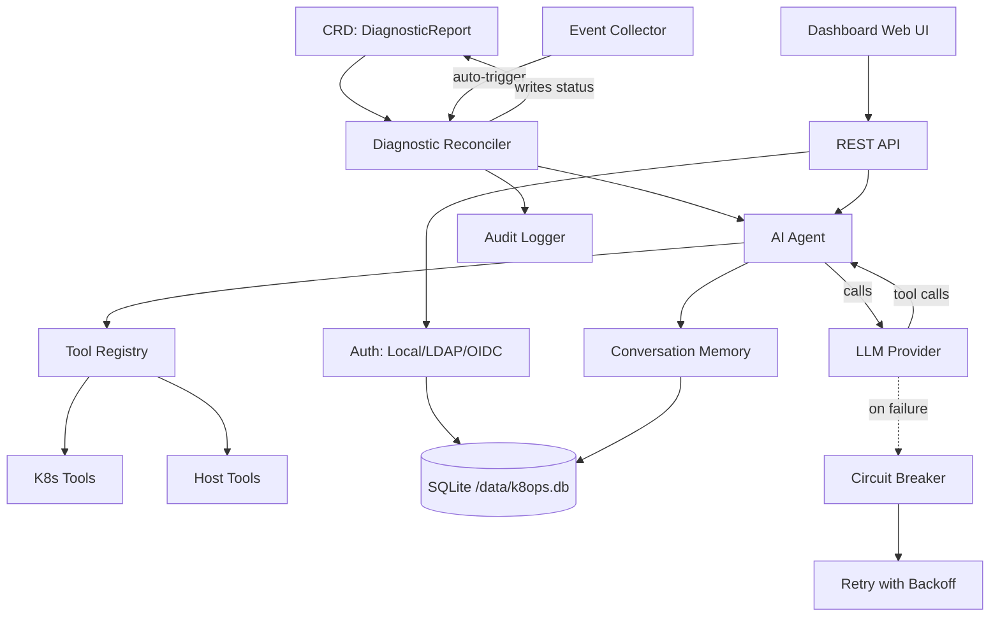

# k8ops 아키텍처

## 개요

k8ops는 AI 에이전트를 사용하여 클러스터 문제를 진단하고, 최적화를 제안하며, 수정 조치를 실행하는 Kubernetes AIOps 오퍼레이터입니다. 클러스터 내 컨트롤러와 내장 웹 대시보드로 실행됩니다.

## 6계층 아키텍처

```
┌─────────────────────────────────────────────────────────────┐
│                    Dashboard Layer                          │
│  Embedded Web UI + REST API (port :9090)                    │
│  dashboard/server.go                                        │
├─────────────────────────────────────────────────────────────┤
│                    Service Layer                            │
│  auth · chat · provider · providermanager · metrics ·       │
│  audit · memory · collector · resilience · safety           │
├─────────────────────────────────────────────────────────────┤
│                    Agent Layer                              │
│  Observe → Think → Act loop (agent/agent.go)                │
│  Max 15 steps, 180s timeout, tool-calling LLM               │
├─────────────────────────────────────────────────────────────┤
│                    Controller Layer                         │
│  diagnostic · optimization · remediation reconcilers        │
│  Watches CRDs, triggers Agent, writes results back          │
├─────────────────────────────────────────────────────────────┤
│                    Tool Layer                               │
│  tools/k8s (get/describe/logs/exec/top)                     │
│  tools/host (process, dmesg) · tools/remediation            │
│  tools/registry.go — thread-safe tool registry              │
├─────────────────────────────────────────────────────────────┤
│                    API Layer (CRD Types)                    │
│  api/v1alpha1: DiagnosticReport, OptimizationSuggestion,   │
│  RemediationPlan, K8opsConfig                              │
└─────────────────────────────────────────────────────────────┘
```

## 컴포넌트 관계



## 데이터 흐름

### 자동 진단 흐름

```
1. Kubernetes Event (e.g., Pod CrashLoopBackOff)
   ↓
2. Event Collector detects anomaly
   ↓
3. Controller creates DiagnosticReport CRD
   ↓
4. Diagnostic Reconciler picks up CRD
   ↓
5. Agent launches Observe→Think→Act loop:
   a. Observe: collects events, logs, resource state via tools
   b. Think: sends context to LLM with tool definitions
   c. Act: executes tool calls (kubectl describe, logs, etc.)
   d. Loop: feeds results back (max 15 steps, 180s timeout)
   ↓
6. Agent writes analysis + recommendations to CRD status
   ↓
7. Dashboard displays results in Web UI
```

### 대화형 채팅 흐름

```
1. User authenticates (Local/LDAP/OIDC) → JWT token
   ↓
2. User sends message via Dashboard /api/chat (SSE)
   ↓
3. Chat Engine creates/reuses Conversation (memory layer)
   ↓
4. Provider Manager selects active LLM provider
   ↓
5. Agent loop: LLM ↔ Tools (with retry + circuit breaker)
   ↓
6. Streaming response via SSE to browser
   ↓
7. Conversation stored with TTL cleanup (30min idle, 1000 cap)
```

### 복원력 (Resilience)

- **재시도 (Retry)**: 5회 시도, 지수 백오프 (1s→30s, 2x 배수)
- **서킷 브레이커 (Circuit Breaker)**: 연속 5회 실패 후 오픈, 60s 쿨다운
- **재시도 가능한 오류**: 429, 500, 502, 503, timeout, connection errors
- **재시도 불가능한 오류**: 400, 401, 403, 404

## 배포 아키텍처

```
┌──────────────────────────────────────────┐
│           k8ops Pod                       │
│                                           │
│  ┌─────────────┐  ┌──────────────────┐   │
│  │  Manager     │  │  Dashboard       │   │
│  │  (controller)│  │  (web :9090)     │   │
│  └──────┬───────┘  └────────┬─────────┘   │
│         │                   │              │
│  ┌──────┴───────────────────┴─────────┐   │
│  │         SQLite (/data/k8ops.db)    │   │
│  └────────────────────────────────────┘   │
│                                           │
│  ┌────────────────────────────────────┐   │
│  │  PVC (k8ops-data, 1Gi)             │   │
│  │  mounted at: /data                 │   │
│  └────────────────────────────────────┘   │
└──────────────────────────────────────────┘
         │                    │
    ┌────┴────┐         ┌────┴────┐
    │ K8s API │         │ LLM API │
    │ (in-cluster) │    │ (egress)│
    └─────────┘         └─────────┘
```

## 배포 모드

### Deployment 모드 (기본값)

단일 Pod로 실행되며 PVC를 통해 데이터를 영속화합니다. 대부분의 시나리오에 적합합니다.

```
┌──────────────────────────────────────────┐
│           k8ops Pod (1 replica)           │
│                                           │
│  ┌─────────────┐  ┌──────────────────┐   │
│  │  Manager     │  │  Dashboard       │   │
│  │  (controller)│  │  (web :9090)     │   │
│  └──────┬───────┘  └────────┬─────────┘   │
│         │                   │              │
│  ┌──────┴───────────────────┴─────────┐   │
│  │         SQLite (/data/k8ops.db)    │   │
│  └────────────────────────────────────┘   │
│                                           │
│  ┌────────────────────────────────────┐   │
│  │  PVC (k8ops-data, 1Gi)             │   │
│  │  mounted at: /data                 │   │
│  └────────────────────────────────────┘   │
└──────────────────────────────────────────┘
         │                    │
    ┌────┴────┐         ┌────┴────┐
    │ K8s API │         │ LLM API │
    └─────────┘         └─────────┘
```

### DaemonSet 모드 (노드별)

각 노드에서 하나의 Pod를 실행하며 노드 수준 진단을 지원합니다. 데이터는 hostPath에 저장됩니다 (각 노드마다 독립적).

```
┌─────────── Node 1 ───────────┐  ┌─────────── Node 2 ───────────┐
│  k8ops Pod (hostPath data)    │  │  k8ops Pod (hostPath data)    │
│  ├── Manager + Dashboard      │  │  ├── Manager + Dashboard      │
│  ├── SQLite (/var/lib/k8ops)  │  │  ├── SQLite (/var/lib/k8ops)  │
│  └── Host mount (/host ro)    │  │  └── Host mount (/host ro)    │
└───────────────────────────────┘  └───────────────────────────────┘
         │                    │
    ┌────┴────┐         ┌────┴────┐
    │ K8s API │         │ LLM API │
    └─────────┘         └─────────┘
```

DaemonSet 모드 특징:
- `tolerations: Exists` — 모든 노드에서 실행 (taint가 있는 노드 포함)
- `hostPath: /var/lib/k8ops` — 노드별 독립 SQLite 데이터
- `hostPath: /` (readOnly) — 진단을 위한 호스트 파일 시스템 읽기 전용 접근
- `hostPath: /var/run` — 컨테이너 런타임 socket 접근
- Service는 label selector를 통해 각 노드의 Pod를 자동으로 검색

### 데이터 저장소

| 저장소 | 위치 | 용도 |
|-------|----------|---------|
| SQLite | `/data/k8ops.db` (PVC 기반) | Users, AuthProviders, RoleDefs, conversations |
| K8s CRDs | API server | DiagnosticReports, OptimizationSuggestions, RemediationPlans |
| K8s Secrets | API server | JWT signing key, provider credentials |
| K8s RBAC | API server | RoleBindings for namespace-scoped users |

### 주요 설계 결정사항

1. **채널 기반 이벤트 루프** — 단일 goroutine이 모든 채팅 상태를 소유하며, 채널을 통해 이벤트 전달
2. **내장 웹 UI** — `go:embed web/*`로 바이너리에서 SPA를 서빙, 별도 프론트엔드 배포 불필요
3. **외부 DB 대신 SQLite** — 운영 간소화, 영속화를 위한 PVC 기반, 동시성을 위한 WAL 모드
4. **CRD를 진실의 원천으로** — 진단/최적화/수정이 K8s 리소스로 저장됨
5. **도구 레지스트리** — 스레드 안전 (`sync.RWMutex`), 시작 시 도구 등록, 확장 가능
6. **프로바이더 추상화** — `provider.Provider` 인터페이스로 OpenAI, Anthropic, Gemini, 커스텀 엔드포인트 지원
7. **임퍼스네이션 (Impersonation)** — K8s API 호출 시 RBAC 적용을 위해 사용자별 식별자 사용
8. **요청 추적** — 모든 요청에 `X-Request-ID` 부여 (자동 생성 또는 전파), 로그 상관 관계 가능
9. **HTTP 메트릭** — Prometheus가 엔드포인트별 요청 수, 지연 시간 히스토그램, 진행 중 게이지, 오류율 추적
10. **경로 정규화** — `/api/pods/{ns}/{name}/logs` 템플릿으로 메트릭 카디널리티 감소

## 빌드 및 실행

```bash
# Build
make build              # → bin/manager, bin/k8ops

# Run locally
make run PROVIDER_TYPE=openai PROVIDER_MODEL=gpt-4o

# Deploy to cluster
make deploy

# Docker
make docker-build IMG=ghcr.io/ggai/k8ops:latest
```

## 설정

| Flag | Env Var | Default | Description |
|------|---------|---------|-------------|
| `--metrics-bind-address` | — | `:8080` | Prometheus metrics |
| `--health-probe-bind-address` | — | `:8081` | Liveness/readiness |
| `--dashboard-address` | — | `:9090` | Web UI + API |
| `--provider-type` | — | `openai` | LLM provider |
| `--provider-model` | — | — | Model name |
| `--provider-api-key` | `AIOPS_API_KEY` | — | LLM API key |
| `--auth-db-path` | `AUTH_DB_PATH` | `/data/k8ops.db` | SQLite path |
| `--auth-jwt-secret` | `AUTH_JWT_SECRET` | (random) | JWT signing key |
| — | `CORS_ALLOWED_ORIGINS` | — | Comma-separated allowed origins |
