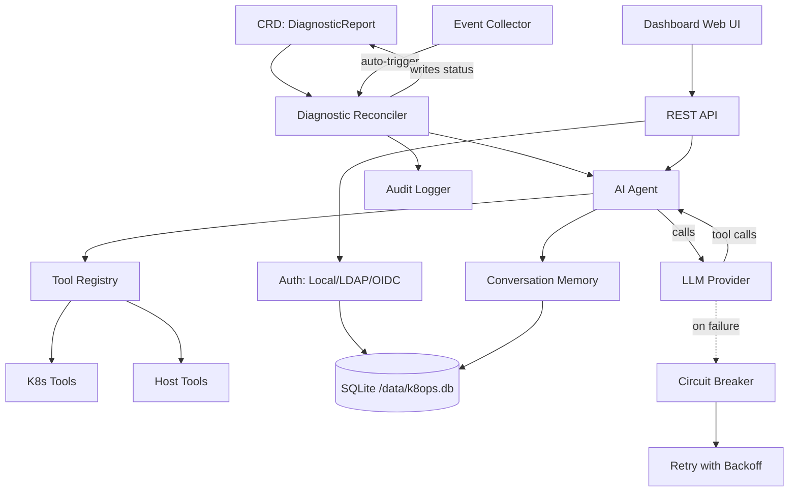

# k8ops 架构

## 概述

k8ops 是一个 Kubernetes AIOps Operator，使用 AI Agent 来诊断集群问题、提供优化建议并执行修复。它以集群内控制器的方式运行，内嵌 Web 仪表板。

## 六层架构

```
┌─────────────────────────────────────────────────────────────┐
│                    仪表板层                                 │
│  内嵌 Web UI + REST API (端口 :9090)                        │
│  dashboard/server.go                                        │
├─────────────────────────────────────────────────────────────┤
│                    服务层                                   │
│  auth · chat · provider · providermanager · metrics ·       │
│  audit · memory · collector · resilience · safety           │
├─────────────────────────────────────────────────────────────┤
│                    代理层                                   │
│  Observe → Think → Act 循环 (agent/agent.go)                │
│  最多 15 步，180s 超时，工具调用 LLM                         │
├─────────────────────────────────────────────────────────────┤
│                    控制器层                                 │
│  diagnostic · optimization · remediation reconcilers        │
│  监听 CRD，触发代理，回写结果                                │
├─────────────────────────────────────────────────────────────┤
│                    工具层                                   │
│  tools/k8s (get/describe/logs/exec/top)                     │
│  tools/host (process, dmesg) · tools/remediation            │
│  tools/registry.go — 线程安全工具注册表                      │
├─────────────────────────────────────────────────────────────┤
│                    API 层 (CRD 类型)                        │
│  api/v1alpha1: DiagnosticReport, OptimizationSuggestion,   │
│  RemediationPlan, K8opsConfig                              │
└─────────────────────────────────────────────────────────────┘
```

## 组件关系



## 数据流

### 自动诊断流程

```
1. Kubernetes 事件 (例如 Pod CrashLoopBackOff)
   ↓
2. 事件收集器检测到异常
   ↓
3. 控制器创建 DiagnosticReport CRD
   ↓
4. 诊断 Reconciler 接收 CRD
   ↓
5. 代理启动 Observe→Think→Act 循环：
   a. Observe（观察）：通过工具收集事件、日志、资源状态
   b. Think（思考）：将上下文和工具定义发送给 LLM
   c. Act（行动）：执行工具调用（kubectl describe、logs 等）
   d. Loop（循环）：将结果回传（最多 15 步，180s 超时）
   ↓
6. 代理将分析和建议写入 CRD status
   ↓
7. 仪表板在 Web UI 中展示结果
```

### 交互式对话流程

```
1. 用户认证 (Local/LDAP/OIDC) → JWT token
   ↓
2. 用户通过 Dashboard /api/chat 发送消息 (SSE)
   ↓
3. 对话引擎创建/复用会话（内存层）
   ↓
4. Provider Manager 选择活跃的 LLM provider
   ↓
5. 代理循环：LLM ↔ Tools（含重试 + 断路器）
   ↓
6. 通过 SSE 向浏览器流式返回响应
   ↓
7. 会话存储并设置 TTL 清理（30min 空闲，1000 条上限）
```

### 弹性容错

- **重试**：5 次尝试，指数退避（1s→30s，2 倍乘数）
- **断路器**：连续 5 次失败后打开，60s 冷却期
- **可重试错误**：429、500、502、503、超时、连接错误
- **不可重试**：400、401、403、404

## 部署架构

```
┌──────────────────────────────────────────┐
│           k8ops Pod                       │
│                                           │
│  ┌─────────────┐  ┌──────────────────┐   │
│  │  Manager     │  │  Dashboard       │   │
│  │  (controller)│  │  (web :9090)     │   │
│  └──────┬───────┘  └────────┬─────────┘   │
│         │                   │              │
│  ┌──────┴───────────────────┴─────────┐   │
│  │         SQLite (/data/k8ops.db)    │   │
│  └────────────────────────────────────┘   │
│                                           │
│  ┌────────────────────────────────────┐   │
│  │  PVC (k8ops-data, 1Gi)             │   │
│  │  mounted at: /data                 │   │
│  └────────────────────────────────────┘   │
└──────────────────────────────────────────┘
         │                    │
    ┌────┴────┐         ┌────┴────┐
    │ K8s API │         │ LLM API │
    │ (in-cluster) │    │ (egress)│
    └─────────┘         └─────────┘
```

## 部署模式

### Deployment 模式（默认）

单 Pod 运行，通过 PVC 持久化数据。适合大多数场景。

```
┌──────────────────────────────────────────┐
│           k8ops Pod (1 replica)           │
│                                           │
│  ┌─────────────┐  ┌──────────────────┐   │
│  │  Manager     │  │  Dashboard       │   │
│  │  (controller)│  │  (web :9090)     │   │
│  └──────┬───────┘  └────────┬─────────┘   │
│         │                   │              │
│  ┌──────┴───────────────────┴─────────┐   │
│  │         SQLite (/data/k8ops.db)    │   │
│  └────────────────────────────────────┘   │
│                                           │
│  ┌────────────────────────────────────┐   │
│  │  PVC (k8ops-data, 1Gi)             │   │
│  │  mounted at: /data                 │   │
│  └────────────────────────────────────┘   │
└──────────────────────────────────────────┘
         │                    │
    ┌────┴────┐         ┌────┴────┐
    │ K8s API │         │ LLM API │
    └─────────┘         └─────────┘
```

### DaemonSet 模式（每节点）

每个节点运行一个 Pod，支持节点级诊断。数据存储在 hostPath（每节点独立）。

```
┌─────────── Node 1 ───────────┐  ┌─────────── Node 2 ───────────┐
│  k8ops Pod (hostPath data)    │  │  k8ops Pod (hostPath data)    │
│  ├── Manager + Dashboard      │  │  ├── Manager + Dashboard      │
│  ├── SQLite (/var/lib/k8ops)  │  │  ├── SQLite (/var/lib/k8ops)  │
│  └── Host mount (/host ro)    │  │  └── Host mount (/host ro)    │
└───────────────────────────────┘  └───────────────────────────────┘
         │                    │
    ┌────┴────┐         ┌────┴────┐
    │ K8s API │         │ LLM API │
    └─────────┘         └─────────┘
```

DaemonSet 模式特点：
- `tolerations: Exists` — 在所有节点运行（包括 tainted 节点）
- `hostPath: /var/lib/k8ops` — 每节点独立 SQLite 数据
- `hostPath: /` (readOnly) — 只读访问主机文件系统用于诊断
- `hostPath: /var/run` — 访问容器运行时 socket
- Service 通过 label selector 自动发现各节点 Pod

### 数据存储

| 存储位置 | 路径 | 用途 |
|---------|------|------|
| SQLite | `/data/k8ops.db`（PVC 持久化） | 用户、认证 Provider、角色定义、会话 |
| K8s CRD | API server | DiagnosticReports、OptimizationSuggestions、RemediationPlans |
| K8s Secrets | API server | JWT 签名密钥、Provider 凭据 |
| K8s RBAC | API server | 命名空间范围用户的 RoleBindings |

### 关键设计决策

1. **Channel 驱动事件循环** — 单 goroutine 拥有所有对话状态，事件通过 channel 传递
2. **内嵌 Web UI** — `go:embed web/*` 从二进制文件提供 SPA 服务，无需独立前端部署
3. **SQLite 优于外部数据库** — 简化运维，PVC 持久化，WAL 模式支持并发
4. **CRD 作为唯一真相来源** — 诊断/优化/修复结果存储为 K8s 资源
5. **工具注册表** — 线程安全（`sync.RWMutex`），启动时注册工具，可扩展
6. **Provider 抽象** — `provider.Provider` 接口支持 OpenAI、Anthropic、Gemini、自定义端点
7. **身份模拟（Impersonation）** — 对 K8s API 的调用使用用户特定身份以执行 RBAC
8. **请求追踪** — 每个请求会获得 `X-Request-ID`（自动生成或透传），支持日志关联
9. **HTTP 指标** — Prometheus 追踪每端点的请求计数、延迟直方图、在途请求量、错误率
10. **路径标准化** — `/api/pods/{ns}/{name}/logs` 模板减少指标基数

## 构建与运行

```bash
# 构建
make build              # → bin/manager, bin/k8ops

# 本地运行
make run PROVIDER_TYPE=openai PROVIDER_MODEL=gpt-4o

# 部署到集群
make deploy

# Docker
make docker-build IMG=ghcr.io/ggai/k8ops:latest
```

## 配置

| 参数 | 环境变量 | 默认值 | 说明 |
|------|---------|--------|------|
| `--metrics-bind-address` | — | `:8080` | Prometheus 指标 |
| `--health-probe-bind-address` | — | `:8081` | 存活/就绪探针 |
| `--dashboard-address` | — | `:9090` | Web UI + API |
| `--provider-type` | — | `openai` | LLM provider |
| `--provider-model` | — | — | 模型名称 |
| `--provider-api-key` | `AIOPS_API_KEY` | — | LLM API 密钥 |
| `--auth-db-path` | `AUTH_DB_PATH` | `/data/k8ops.db` | SQLite 路径 |
| `--auth-jwt-secret` | `AUTH_JWT_SECRET` | （随机） | JWT 签名密钥 |
| — | `CORS_ALLOWED_ORIGINS` | — | 逗号分隔的允许源 |
